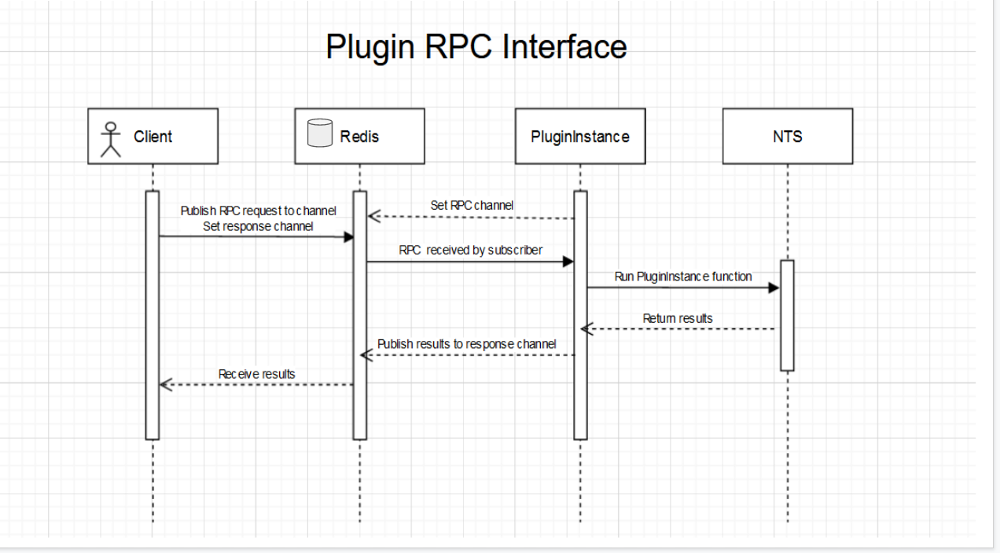

# Redis Pubsub interface for Nanome Workspaces

Nanome is an immersive XR platform for collaborative computationally-driven molecular design. Learn more about Nanome at https://nanome.ai.

This plugin creates an interface for interacting with your workspace via Redis PubSub messages. This enables simpler programmatic communication between applications. For example, Nanome's Jupyter notebooks communicate with your workspace via this interface. (https://github.com/nanome-ai/plugin-cookbook)

## Installation

### Requirements:
- Docker (https://docs.docker.com/get-docker/)
- Docker Compose (https://docs.docker.com/compose/install/)

### Clone, Build,  and deploy
1) Use Git to clone this repository to your computer.
```sh
git clone https://github.com/nanome-ai/plugin-redis-pubsub.git
````

3) Create .env file, containing NTS connection values, as well as credentials for a running Redis instance
```sh
cp .env.sample .env

REDIS_HOST=localhost
REDIS_PORT=6379
REDIS_PASSWORD=12345678
PLUGIN_NAME=Redis-api

```

3) Build and deploy
```sh
python run.py
```

## Redis RPC architecture
- `plugin_service` container runs your standard plugin instance. When activated in Nanome, When the plugin is run, it subscribes to the Redis channel, and starts polling, waiting to receive messages containing info on what function to run.

```
{
  "function": <function_name>
  "args": [...],
  "kwargs": {...},
  "response_channel": "uuid4()"
}
```
- When the message is received by `plugin_service`, it parses it and executes the provided function with args and kwargs. It then publishes the results back to the designated `response_channel`.



## Contributors
@mjrosengrant
@ajm13
